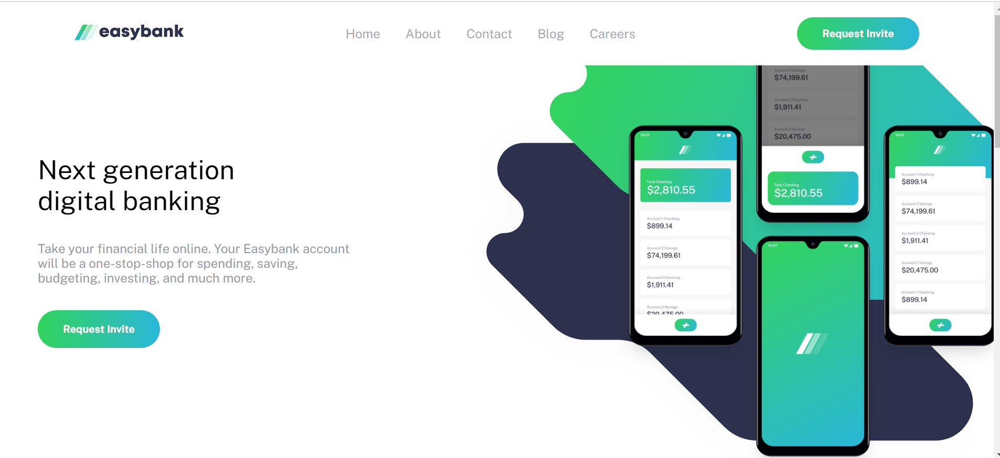
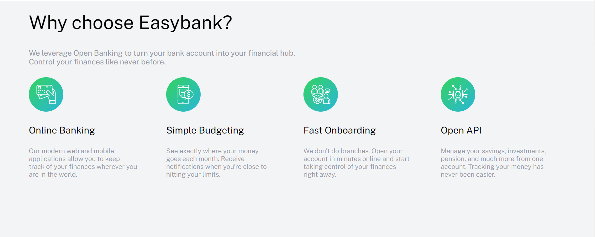
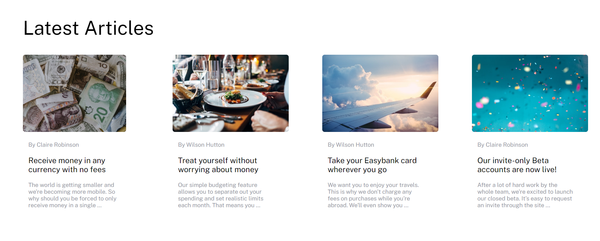
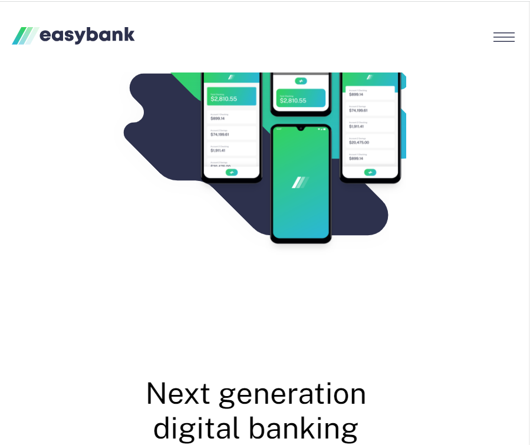
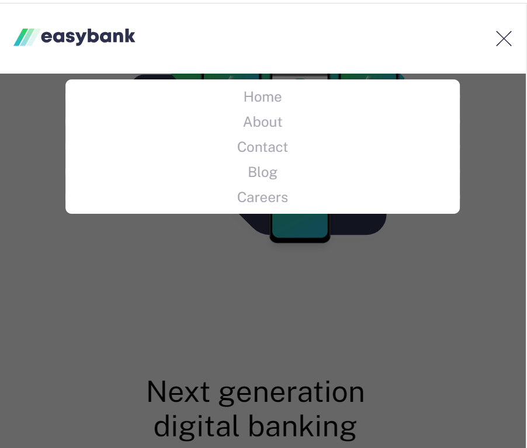

# custom-easybank-frontend-mentor
This is a solution to the [Easybank landing page challenge on Frontend Mentor](https://www.frontendmentor.io/challenges/easybank-landing-page-WaUhkoDN). Frontend Mentor challenges help you improve your coding skills by building realistic projects. 

## Table of contents
- [Overview](#overview)
  - [The challenge](#the-challenge)
  - [Screenshot](#screenshot)
  - [Links](#links)
- [My process](#my-process)
  - [Built with](#built-with)
  - [What I learned](#what-i-learned)
  - [Continued development](#continued-development)
  - [Useful resources](#useful-resources)
- [Author](#author)
- [Acknowledgments](#acknowledgments)

## Overview

### The challenge

Users should be able to

- View the designed layout of the Easybank landing page on desktop and mobile
- Interact with navigation buttons on the SPA (Single Page Applicaiton)
- Visualize when the the user is hovering on an element
- Built to let the user focus on navigation on Mobile

### Screenshot









### Links

Currently the webpage is not online at the moment

## My process
### Built with

- HTML
- CSS
    - Flexbox
    - Positioning Concepts
- Vanilla JavaScript
    - DOM manipulation

### What I learned

Here are some of the things I learned
- implement a dropdown when the selections already exist.
- How to ask questions on StackOverFlow for HTML, CSS, and JS
- Used Abstraction in my CSS classes


Here are some sample codes I am proud of

HTML:
```html
<ul class="nav-items">
      <li class="nav-items nav-li"><a href=#>Home</a></li>
      <li class="nav-items nav-li"><a href=#>About</a></li>
      <li class="nav-items nav-li"><a href=#>Contact</a></li>
      <li class="nav-items nav-li"><a href=#>Blog</a></li>
      <li class="nav-items nav-li"><a href=#>Careers</a></li>
</ul>
```

CSS:
```css
 .mobileNav {
    color: rgb(150, 152, 166, 0.85);
    display: block;
    width: 100%;
    background-color: #fff;
    filter: brightness(100%);       
    border-radius: 8px;
    margin: 10px 0 0 0;    
}

.mobileNav:nth-child(5) {
    margin: 10px 0 10px 0; 
}

.nav-items-mobile {
    position: absolute;
    bottom: -200%;
    width: 75%;
    background-color: #fff;
    border-radius: 7px;
    margin: 0 auto;
    left: 50%;
    transform: translateX(-50%)
}
```

JS: 
```js
function displayNav() {
    navMobileOpen = !navMobileOpen
    if (!navMobileOpen) {
        img.src = './images/icon-close.svg'
        navItems.forEach(item => {
            item.classList.remove("hide")
            item.classList.add("mobileNav")
        })
        ul.classList.add("nav-items-mobile")
        ul.classList.remove("nav-items")
        document.querySelector('.upper-body').classList.add("bg-dark")
        document.querySelector('.main-body-two').classList.add("bg-dark-2")
        document.querySelector('.lower-body').classList.add("bg-dark")
        
       
       } 
    if (navMobileOpen) {
        img.src = './images/icon-hamburger.svg'
        ul.classList.remove("nav-items-mobile")
        ul.classList.add("nav-items")
        navItems.forEach(item => {
            item.classList.add("hide")
            item.classList.remove("mobileNav")
        })
        document.querySelector('.upper-body').classList.remove("bg-dark")
        document.querySelector('.main-body-two').classList.remove("bg-dark-2")
        document.querySelector('.lower-body').classList.remove("bg-dark")

    } 
        
}
```
### Continued development

I would definetely love to work on responsive design more, and have a more proficient understadning of manipulating the DOM. In my next project, I will focus on mastering CSS positioning and transitions.

### Useful resources

- [Stackoverflow](https://stackoverflow.com/) - This helped me whenever I was stuck on specfic questions involving my code.
- [Javapoint](https://javapoint.com) - This helped me gain the fundamentals of how to create a dropdown.

## Author

Yousef Marey

## Acknowledgements

- [EJam](https://stackoverflow.com/users/20023905/ejam) - EJam from Stackoverflow has helpped me
- [Ouroborus](https://stackoverflow.com/users/367865/ouroborus) - Ouroborus from stackoverflow has helped me.
